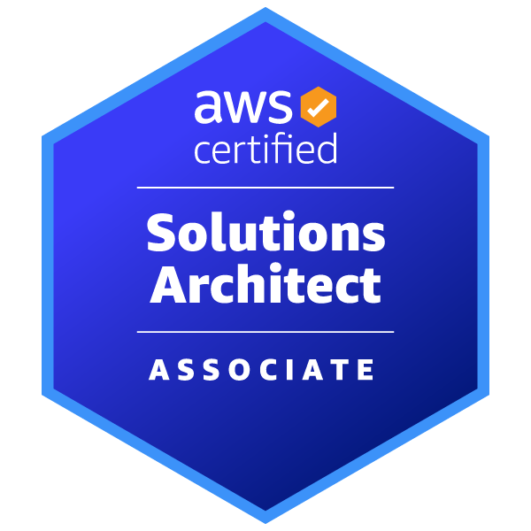
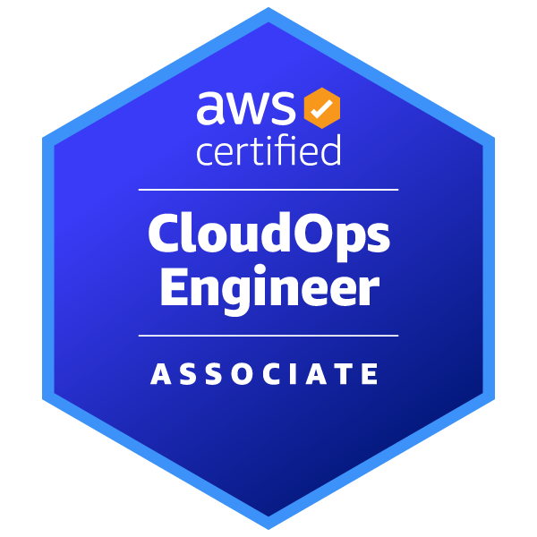
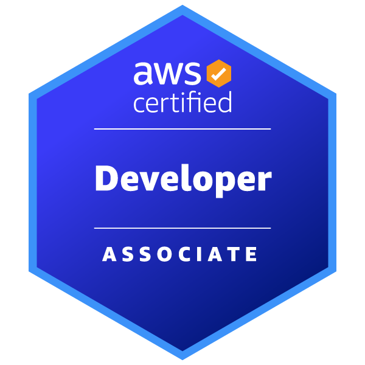
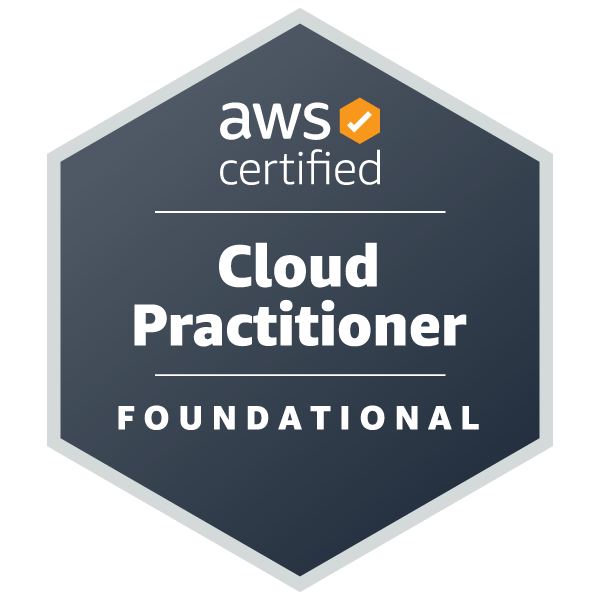

# Nguyen Trung Kien — DevOps & Cloud Engineer

  

  

---

### 👋 About Me

Hello! I’m **Nguyễn Trung Kiên** — a Cloud & DevOps Engineer passionate about architecting automated, highly available, secure, and cost-optimized cloud platforms on AWS.

Currently studying **Computer Networks and Data Communications** at **University of Information Technology – VNU-HCM (UIT)** (2024 – 2028).

- ☁️ **Cloud Architecture & Resilience**: Designing distributed systems aligned with the AWS Well-Architected Framework, specializing in automated Multi-Region Disaster Recovery (Backup & Restore with $0 standby compute cost).
- ☸️ **Kubernetes & GitOps**: Building bare-metal and cloud Kubernetes clusters (K8s/K3s, EKS) with automated GitOps delivery pipelines (Argo CD, Helm, Kustomize).
- 🛡️ **DevSecOps & Supply Chain Security**: Enforcing security early in CI/CD pipelines (Trivy, SonarQube, Falco, Kyverno), container hardening (non-root, read-only rootfs), and least privilege IAM/RBAC.
- ⚡ **Serverless & Automation**: Event-driven architectures using AWS SAM, Lambda, Step Functions, EventBridge, DynamoDB, API Gateway, and IaC (Terraform, CloudFormation, Ansible).

My engineering philosophy:

  

---

### 🏅 AWS Professional Certifications

  

| Badge | Certification Name | Level | Issuer | Validity | Verification |
|:---:|:---|:---:|:---:|:---:|:---:|
|  | **AWS Certified Solutions Architect – Associate** | Associate | Amazon Web Services | 2026 – 2029 | [Credly Badge ↗](https://www.credly.com/badges/fb64362a-24b4-4006-bc6d-d7fd1428a9e1) |
|  | **AWS Certified SysOps Administrator – Associate** | Associate | Amazon Web Services | 2026 – 2029 | [Credly Badge ↗](https://www.credly.com/badges/bd2c6f2c-da53-4fe3-87bb-ec2e22c155ad) |
|  | **AWS Certified Developer – Associate** | Associate | Amazon Web Services | 2026 – 2029 | [Credly Badge ↗](https://www.credly.com/badges/e3fdcd6b-e0b5-420e-9dde-993c89617e19) |
|  | **AWS Certified Cloud Practitioner** | Foundational | Amazon Web Services | 2026 – 2029 | [Credly Badge ↗](https://www.credly.com/badges/74d3175c-1eda-4ee4-ac65-dfb0cc552706) |

---

### 🚀 Featured Engineering Projects

#### 1. [AWS Multi-Region Disaster Recovery Platform (NT533)](https://github.com/Kien-devops/NT533)
*Cost-optimized Backup & Restore architecture between Sydney (`ap-southeast-2` - Primary) and Singapore (`ap-southeast-1` - Cold Standby) with 100% automated failover.*
- **Automated Failover Orchestration**: CloudWatch Composite Alarm triggers cross-region EventBridge events to execute an AWS Step Functions State Machine (57 states).
- **Zero Standby Compute Cost**: Cold Standby state incurs $0 running compute/database costs until failover is initiated, utilizing encrypted AWS Backup Vault cross-region replication and ECR replication.
- **Full-Stack Provisioning**: Automated DynamoDB singleton locking, CloudFormation runtime stack deployment, RDS snapshot restoration, ECS Fargate auto-scaling with 3 target group health checks, and Route 53 SECONDARY failover record UPSERT.
- **RTO & RPO**: Actual RTO 20–40 minutes, RPO ≤ 6 hours.
- **Tech Stack**: AWS CloudFormation, Step Functions, ECS Fargate, Amazon RDS PostgreSQL, AWS Backup, Route 53, EventBridge, Lambda, DynamoDB, ECR, Docker, Python, PowerShell.

#### 2. [On-Premise K3s DevSecOps & Microservices Platform](https://github.com/Kien-devops/k3s-onprem) | [App Demo: app1.onprem.site](https://app1.onprem.site)
*Production-ready bare-metal K3s infrastructure managed via Ansible combined with a secured microservices CI/CD pipeline ([app1](https://github.com/Kien-devops/app1)).*
- **Bare-Metal Cluster Automation**: 3-node physical Ubuntu setup automated 100% with Ansible roles/playbooks, Flannel VXLAN overlay network, and HAProxy for TCP ingress/API load balancing.
- **Zero-Port Public Access**: Safe public ingress routing via Traefik and Cloudflare Tunnel (`app1.onprem.site`) without open firewall ports.
- **Microservices Architecture**: React/Vite frontend (NGINX unprivileged) with 3 decoupled Node.js microservices (Auth, User, Product) equipped with structured JSON logging and Prometheus `/metrics`.
- **Shift-Left Security & CI/CD**: Container execution in non-root mode, read-only root filesystems, dropped Linux capabilities, default-deny NetworkPolicies, automated Trivy scanning for CVEs, immutable Git SHA tagging to GHCR, and zero-downtime rolling updates.
- **Tech Stack**: Kubernetes (K3s), Ansible, HAProxy, Traefik, GitHub Actions, Trivy, GHCR, Cloudflare Tunnel, Docker, Node.js, React, Nginx, Linux.

---

### 🛡️ DevSecOps & Cloud Security Practices

*   **🔒 Cloud Infrastructure Security (AWS)**
    *   **Compute & Orchestration**: Deploying secure workloads on **AWS EC2**, **Amazon ECS (Fargate)**, and **Amazon EKS (Kubernetes)** with strict network segregation.
    *   **IAM Least Privilege**: Enforcing granular IAM policies, mapping Kubernetes service accounts to AWS IAM Roles (IRSA), and minimizing root/admin usage.
    *   **Network Isolation**: Architecting multi-VPC environments with secure **VPC Peering**, Private Subnets, NAT Gateways, Transit Gateways, and strict Security Groups.
*   **🚀 Automated Secure Pipelines (CI/CD & GitOps)**
    *   **Orchestration**: Building declarative, repeatable pipelines using **GitHub Actions**, **Argo CD**, and **Jenkins** to automate build, security, and deployment steps.
    *   **Static Code Quality & Security**: Implementing **SonarQube** quality gates to catch code smells, bugs, and security vulnerabilities early in the commit phase.
    *   **Vulnerability Scanning**: Scanning container base images, dependencies, and filesystems using **Trivy** for CVE detection before pushing to container registries.
    *   **Artifact Repository**: Storing and managing secure docker images and packages in **GitHub Container Registry (GHCR)** and **Sonatype Nexus** with registry scanning enabled.
*   **🔑 Secrets Management & Configuration**
    *   Implementing GitOps-safe secrets management using **HashiCorp Vault**, **AWS Secrets Manager**, and **Kubernetes External Secrets Operator (ESO)** to eliminate hardcoded credentials in repositories.
*   **📊 Observability & Reliability Monitoring**
    *   Monitoring infrastructure metrics, resource exhaustion, and security events using **Prometheus**, **Loki**, and visualizing them via dynamic **Grafana** dashboards with Alertmanager notifications.

---

### 🛠️ Tech Stack & Tooling

  

---

### 🌐 Connect with Me

  
  &nbsp;
  
  &nbsp;
  
  &nbsp;
  
  &nbsp;
  

---

  

